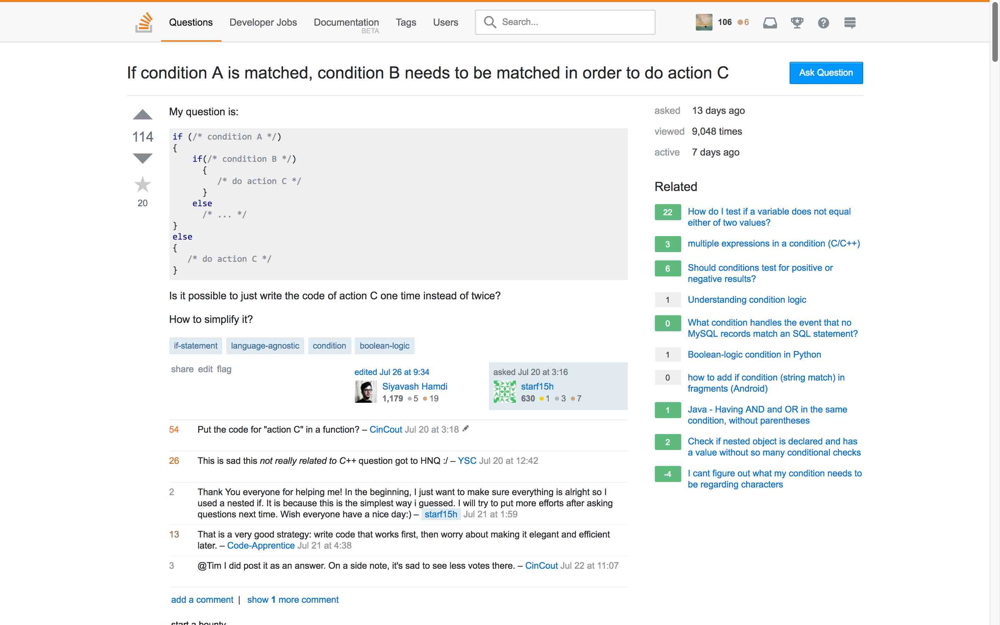

# Introduction

`distract-overflow` is a tiny Chrome extension for hiding distracting elements from Stack Exchange network pages while retaining elements related to the topic at hand. Combined with an ad blocker, question pages look like this:

`distract-overflow` hides:
 - the **Hot Network Questions** element *(links to unrelated questions)*
 - the **Hire Me** element *(shows job listings in sidebar)*
 - the **Community Bulletin** element *(links to blog, meta posts)*
 - the **Newsletter** element *(stack exchange newsletter promotion)*
 - the **Chat** element *(shows active chat users, links to chat)*
 
Note that the entire sidebar is not removed. Because they often prove useful in getting helpful answers, the Related Questions, Related Tags, and Favorite Tags elements are retained.

# Installation
In the future, `distract-overflow` will be available via the [Chrome Web Store](https://chrome.google.com/webstore/category/extensions). Until then, this procedure can be used to install it for free using developer mode:
 - Open Chrome and navigate to `chrome://extensions/`
 - Check the box for **developer mode** in the top right corner
 - Press the **Load unpacked extension...** button
 - Select your `distract-overflow` directory
 - Enjoy!
